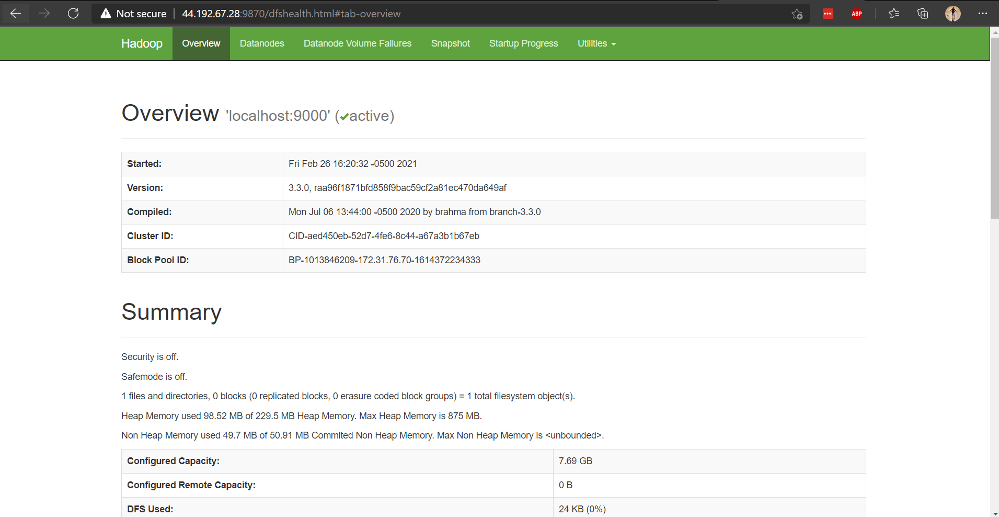
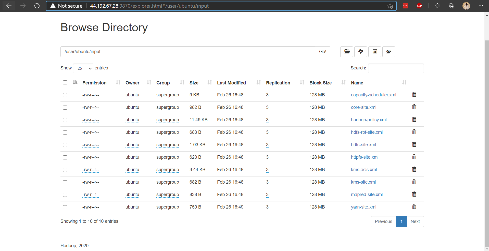
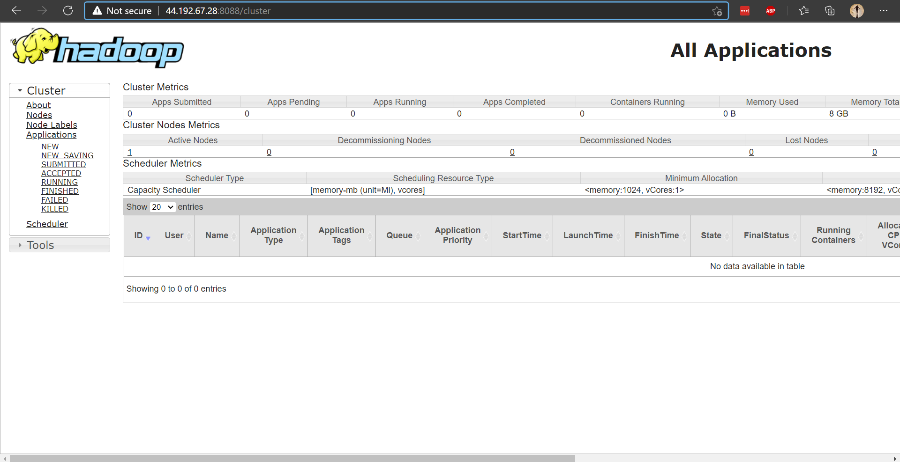

# Taller 5b
#### Big Data
#### ***Víctor Samuel Pérez Díaz***

# 2
---
**1.** 

Con el segundo parámetro define `fs. defaultFS`, el cual es el nombre del file system por defecto, a `hdfs://localhost:9000/`.

**3.** 

El primer parámetro `dfs.replication` define el número total de archivos en el file system a `1`.

**5.** 

El parámetro `mapreduce.framework.name` define el framework de ejecución de MapReduce a `YARN`.

**6.** 

El parámetro fijado `yarn.nodemanager.aux-services` define el servicio auxiliar del NodeManager a `mapreduce_suffle`.

**9.**

```bash
STARTUP_MSG:   java = 1.8.0_282
************************************************************/
2021-02-26 20:43:53,170 INFO namenode.NameNode: registered UNIX signal handlers for [TERM, HUP, INT]
2021-02-26 20:43:53,288 INFO namenode.NameNode: createNameNode [-format]
2021-02-26 20:43:53,960 INFO namenode.NameNode: Formatting using clusterid: CID-aed450eb-52d7-4fe6-8c44-a67a3b1b67eb
2021-02-26 20:43:54,019 INFO namenode.FSEditLog: Edit logging is async:true
2021-02-26 20:43:54,068 INFO namenode.FSNamesystem: KeyProvider: null
2021-02-26 20:43:54,070 INFO namenode.FSNamesystem: fsLock is fair: true
2021-02-26 20:43:54,072 INFO namenode.FSNamesystem: Detailed lock hold time metrics enabled: false
2021-02-26 20:43:54,085 INFO namenode.FSNamesystem: fsOwner                = ubuntu (auth:SIMPLE)
2021-02-26 20:43:54,085 INFO namenode.FSNamesystem: supergroup             = supergroup
2021-02-26 20:43:54,085 INFO namenode.FSNamesystem: isPermissionEnabled    = true
2021-02-26 20:43:54,085 INFO namenode.FSNamesystem: isStoragePolicyEnabled = true
2021-02-26 20:43:54,085 INFO namenode.FSNamesystem: HA Enabled: false
2021-02-26 20:43:54,155 INFO common.Util: dfs.datanode.fileio.profiling.sampling.percentage set to 0. Disabling file IO profiling
2021-02-26 20:43:54,172 INFO blockmanagement.DatanodeManager: dfs.block.invalidate.limit: configured=1000, counted=60, effected=1000
2021-02-26 20:43:54,172 INFO blockmanagement.DatanodeManager: dfs.namenode.datanode.registration.ip-hostname-check=true
2021-02-26 20:43:54,176 INFO blockmanagement.BlockManager: dfs.namenode.startup.delay.block.deletion.sec is set to 000:00:00:00.000
2021-02-26 20:43:54,176 INFO blockmanagement.BlockManager: The block deletion will start around 2021 Feb 26 20:43:54
2021-02-26 20:43:54,178 INFO util.GSet: Computing capacity for map BlocksMap
2021-02-26 20:43:54,178 INFO util.GSet: VM type       = 64-bit
2021-02-26 20:43:54,181 INFO util.GSet: 2.0% max memory 875 MB = 17.5 MB
2021-02-26 20:43:54,181 INFO util.GSet: capacity      = 2^21 = 2097152 entries
2021-02-26 20:43:54,193 INFO blockmanagement.BlockManager: Storage policy satisfier is disabled
2021-02-26 20:43:54,193 INFO blockmanagement.BlockManager: dfs.block.access.token.enable = false
2021-02-26 20:43:54,201 INFO blockmanagement.BlockManagerSafeMode: dfs.namenode.safemode.threshold-pct = 0.999
2021-02-26 20:43:54,201 INFO blockmanagement.BlockManagerSafeMode: dfs.namenode.safemode.min.datanodes = 0
2021-02-26 20:43:54,201 INFO blockmanagement.BlockManagerSafeMode: dfs.namenode.safemode.extension = 30000
2021-02-26 20:43:54,202 INFO blockmanagement.BlockManager: defaultReplication         = 3
2021-02-26 20:43:54,202 INFO blockmanagement.BlockManager: maxReplication             = 512
2021-02-26 20:43:54,202 INFO blockmanagement.BlockManager: minReplication             = 1
2021-02-26 20:43:54,202 INFO blockmanagement.BlockManager: maxReplicationStreams      = 2
2021-02-26 20:43:54,202 INFO blockmanagement.BlockManager: redundancyRecheckInterval  = 3000ms
2021-02-26 20:43:54,202 INFO blockmanagement.BlockManager: encryptDataTransfer        = false
2021-02-26 20:43:54,202 INFO blockmanagement.BlockManager: maxNumBlocksToLog          = 1000
2021-02-26 20:43:54,240 INFO namenode.FSDirectory: GLOBAL serial map: bits=29 maxEntries=536870911
2021-02-26 20:43:54,240 INFO namenode.FSDirectory: USER serial map: bits=24 maxEntries=16777215
2021-02-26 20:43:54,240 INFO namenode.FSDirectory: GROUP serial map: bits=24 maxEntries=16777215
2021-02-26 20:43:54,240 INFO namenode.FSDirectory: XATTR serial map: bits=24 maxEntries=16777215
2021-02-26 20:43:54,274 INFO util.GSet: Computing capacity for map INodeMap
2021-02-26 20:43:54,275 INFO util.GSet: VM type       = 64-bit
2021-02-26 20:43:54,275 INFO util.GSet: 1.0% max memory 875 MB = 8.8 MB
2021-02-26 20:43:54,275 INFO util.GSet: capacity      = 2^20 = 1048576 entries
2021-02-26 20:43:54,276 INFO namenode.FSDirectory: ACLs enabled? true
2021-02-26 20:43:54,276 INFO namenode.FSDirectory: POSIX ACL inheritance enabled? true
2021-02-26 20:43:54,276 INFO namenode.FSDirectory: XAttrs enabled? true
2021-02-26 20:43:54,276 INFO namenode.NameNode: Caching file names occurring more than 10 times
2021-02-26 20:43:54,284 INFO snapshot.SnapshotManager: Loaded config captureOpenFiles: false, skipCaptureAccessTimeOnlyChange: false, snapshotDiffAllowSnapRootDescendant: true, maxSnapshotLimit: 65536
2021-02-26 20:43:54,286 INFO snapshot.SnapshotManager: SkipList is disabled
2021-02-26 20:43:54,291 INFO util.GSet: Computing capacity for map cachedBlocks
2021-02-26 20:43:54,291 INFO util.GSet: VM type       = 64-bit
2021-02-26 20:43:54,291 INFO util.GSet: 0.25% max memory 875 MB = 2.2 MB
2021-02-26 20:43:54,291 INFO util.GSet: capacity      = 2^18 = 262144 entries
2021-02-26 20:43:54,302 INFO metrics.TopMetrics: NNTop conf: dfs.namenode.top.window.num.buckets = 10
2021-02-26 20:43:54,302 INFO metrics.TopMetrics: NNTop conf: dfs.namenode.top.num.users = 10
2021-02-26 20:43:54,302 INFO metrics.TopMetrics: NNTop conf: dfs.namenode.top.windows.minutes = 1,5,25
2021-02-26 20:43:54,306 INFO namenode.FSNamesystem: Retry cache on namenode is enabled
2021-02-26 20:43:54,306 INFO namenode.FSNamesystem: Retry cache will use 0.03 of total heap and retry cache entry expiry time is 600000 millis
2021-02-26 20:43:54,310 INFO util.GSet: Computing capacity for map NameNodeRetryCache
2021-02-26 20:43:54,310 INFO util.GSet: VM type       = 64-bit
2021-02-26 20:43:54,310 INFO util.GSet: 0.029999999329447746% max memory 875 MB = 268.8 KB
2021-02-26 20:43:54,310 INFO util.GSet: capacity      = 2^15 = 32768 entries
2021-02-26 20:43:54,342 INFO namenode.FSImage: Allocated new BlockPoolId: BP-1013846209-172.31.76.70-1614372234333
2021-02-26 20:43:54,373 INFO common.Storage: Storage directory /home/ubuntu/bigdata/hadoop/tmp/dfs/name has been successfully formatted.
2021-02-26 20:43:54,427 INFO namenode.FSImageFormatProtobuf: Saving image file /home/ubuntu/bigdata/hadoop/tmp/dfs/name/current/fsimage.ckpt_0000000000000000000 using no compression
2021-02-26 20:43:54,584 INFO namenode.FSImageFormatProtobuf: Image file /home/ubuntu/bigdata/hadoop/tmp/dfs/name/current/fsimage.ckpt_0000000000000000000 of size 401 bytes saved in 0 seconds .
2021-02-26 20:43:54,606 INFO namenode.NNStorageRetentionManager: Going to retain 1 images with txid >= 0
2021-02-26 20:43:54,612 INFO namenode.FSImage: FSImageSaver clean checkpoint: txid=0 when meet shutdown.
2021-02-26 20:43:54,613 INFO namenode.NameNode: SHUTDOWN_MSG:
/************************************************************
SHUTDOWN_MSG: Shutting down NameNode at ip-172-31-76-70.ec2.internal/172.31.76.70
************************************************************/
```
---
**13.**


---

# 3

---

**4.**



---

# 4

---

**3.**

